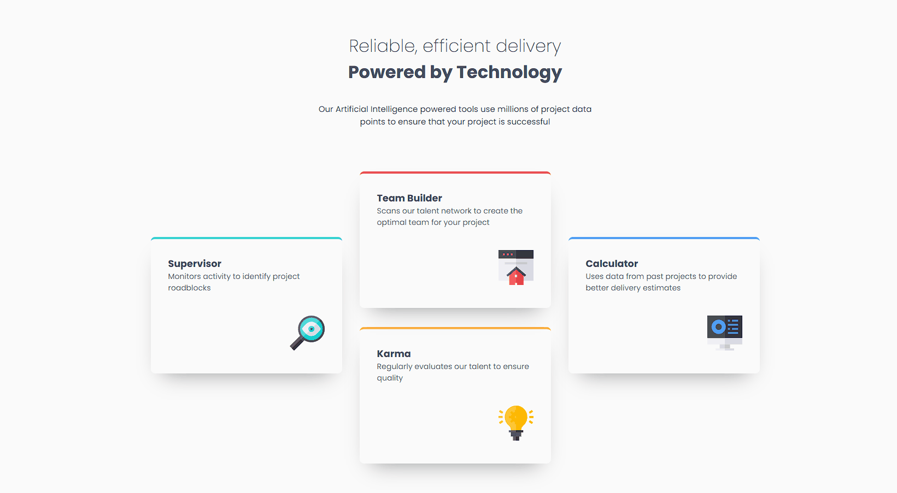

# Frontend Mentor - Four card feature section solution

Esta é uma solução para o [Four card feature section challenge on Frontend Mentor](https://www.frontendmentor.io/challenges/four-card-feature-section-weK1eFYK).  

## Índice

- [Overview](#overview)
  - [O Desafio](#O-Desafio)
  - [Screenshot](#screenshot)
  - [Links](#links)
- [My process](#my-process)
  - [Construído com](#Construído-Com)
  - [O que Aprendi](#what-i-learned)
  - [Continued development](#continued-development)
  - [Useful resources](#useful-resources)
- [Author](#author)

## Overview

### O Desafio

Os usuários devem ser capazes de:

Ver e explorar uma seção de recursos com 4 cartas, não há nenhuma animação neste projeto;
Neste desafio somente com HTML e CSS é um projeto perfeito para iniciantes que querem se familiarizar com os fundamentos de HTML e CSS, como a estrutura HTML e o modelo de caixa(Flexbox) e CSS GRID.

### Screenshot

### Links

- Solution URL: (https://andredantasti.github.io/desafio-four-card/)

## My process

### Construído com

- Semantic HTML5 markup
- CSS custom properties
- Flexbox
- CSS Grid
- Shadow box
- Media Querye

### O que Aprendi

- Nesse projeto foi utilizado display GRID, com apoio do flexbox, projeto bem complicado para se fazer o layout, mas que com os estudos e em consulta a alguns assuntos na internet foi possível conclui-lo com sucesso. Tivemos um pouco de dificuldade, mas nada que com mais estudo ou prática não podemos melhorar. Como sempre nossa maior dificuldade é na hora de deixar o projeto responsivo para tamanhos menores;

### Desenvolvimento Contínuo

Desejo continuar melhorar na questão de espaçamentos do CSS, melhorar e estudar mais sobre display flex e display Grid.
Continuar e melhorar na questão de responsividade, deixando os projetos com maior compatibilidade em diversos instrumentos de acesso.

### Useful resources

None

## Author

- Website - [Andre Dantas](https://github.com/andredantasti)
- Frontend Mentor - [@andredantasti](https://www.frontendmentor.io/profile/andredantasti)
- Instagram - [@andredantasti](https://www.instagram.com/andredantasti)
